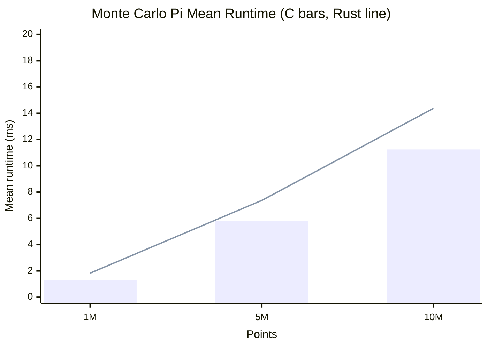
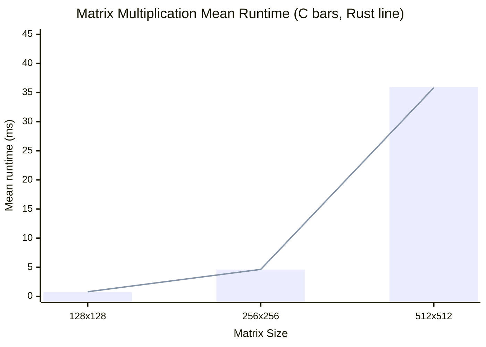
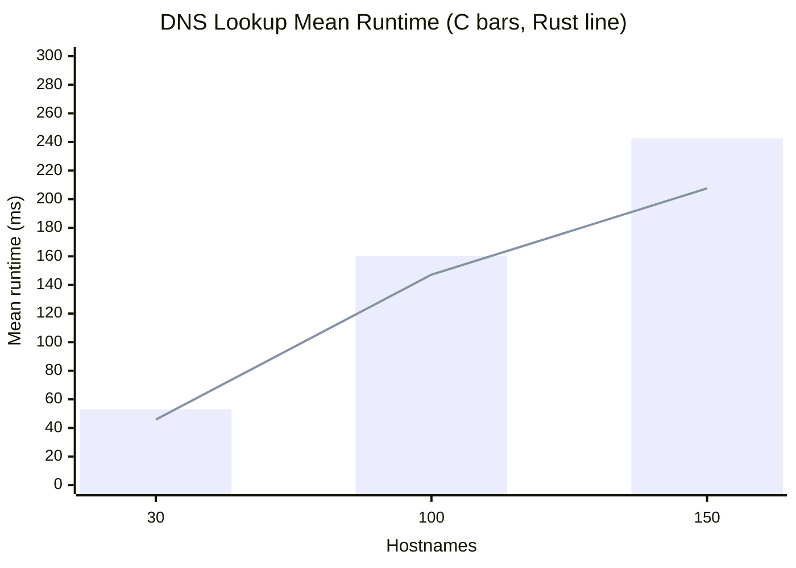

---
tags:
  - csci440
  - operating-systems
  - threads
  - benchmark
cssclasses:
  - osfinal-paper
generated: 2026-05-11
source: results/benchmark_summary.csv
---

# CSCI440 Final Project: C vs Rust Thread Performance

## Rubric Checklist

- [ ] Approved question is clearly stated
- [ ] Workloads and languages are defined
- [ ] Experimental setup includes CPU, memory, OS, compiler versions, and artifacts
- [ ] Testing procedure explains commands, timing method, trials, and workload sizes
- [ ] Results include means, standard deviations, confidence intervals, and margin of error
- [ ] Conclusion answers the question using the evidence
- [ ] Learning outcome is personal and specific
- [ ] Code, scripts, references, and AI citation are included

## Approved Question

How does the performance of threads in C compare to Rust?

This project compares C programs using POSIX pthreads with Rust programs using `std::thread`. The same thread count is used for both languages, and the amount of work changes across three workloads: Monte Carlo pi estimation, matrix multiplication, and DNS hostname resolution.

## Workloads

- Monte Carlo pi estimation: CPU-bound random point generation and counting inside a unit circle.
- Matrix multiplication: CPU-bound multiplication of square matrices using row ranges assigned to worker threads.
- DNS lookup: threaded hostname resolution using the operating system resolver. This workload is intentionally noisier because DNS caching, resolver latency, and network behavior can affect timing.

## Experimental Setup

- Machine: 11th Gen Intel Core i5-11400F at 2.60 GHz
- CPU layout: 6 cores, 12 logical CPUs
- Memory available to WSL during capture: 7.7 GiB
- OS: Ubuntu 24.04.1 LTS running under WSL2
- Kernel: `6.6.114.1-microsoft-standard-WSL2`
- C compiler: GCC 13.3.0
- Rust compiler: rustc 1.94.0
- Cargo: cargo 1.94.0
- Threads used in current summary: 4
- Runs per language/workload case: 50

Possible artifacts to discuss: WSL2 virtualization overhead, background Windows processes, CPU frequency scaling, DNS cache behavior, network latency, and cache effects in matrix multiplication.

## Testing Procedure

The benchmark runner builds all C and Rust programs, generates DNS input files, then runs each language/workload case repeatedly. C timing uses `clock_gettime(CLOCK_MONOTONIC)`. Rust timing uses `std::time::Instant`. The result analyzer computes the mean, standard deviation, 95% confidence interval half-width, and margin of error.

Commands used:

```bash
cd /mnt/c/Users/19255/Documents/OS/OSFINAL
THREADS=4 TRIALS=50 python3 scripts/run_benchmarks.py
python3 scripts/analyze_results.py results/benchmark_raw.csv results/benchmark_summary.csv
python3 scripts/make_obsidian_report.py results/benchmark_summary.csv docs/generated-results.md
```

Confidence value: approximately 95% confidence using z-score `1.96`.

## Current Results Snapshot

- Total individual program runs summarized: 900
- Maximum current margin of error: 26.90%
- Lower runtime is better.
- In the Mermaid charts below, bars are C and the line is Rust.

## Headline Findings

- Monte Carlo Pi: C had the lower mean in 3/3 cases and Rust had the lower mean in 0/3 cases. Using non-overlapping 95% CIs as a conservative check: C likely faster in 3, Rust likely faster in 0, and 0 overlap.
- Matrix Multiplication: C had the lower mean in 2/3 cases and Rust had the lower mean in 1/3 cases. Using non-overlapping 95% CIs as a conservative check: C likely faster in 1, Rust likely faster in 0, and 2 overlap.
- DNS Lookup: C had the lower mean in 0/3 cases and Rust had the lower mean in 3/3 cases. Using non-overlapping 95% CIs as a conservative check: C likely faster in 0, Rust likely faster in 0, and 3 overlap.

<div class="page-break"></div>

## Runtime Graphs

### Monte Carlo Pi



### Matrix Multiplication



### DNS Lookup



<div class="page-break"></div>

## Results Table

| Algorithm | Workload | C mean ms +/- 95% CI | Rust mean ms +/- 95% CI | Lower mean | Speedup | CI Reading |
| --- | --- | --- | --- | --- | --- | --- |
| Monte Carlo Pi | 1M | 1.326 +/- 0.032 | 1.833 +/- 0.049 | C | 1.38x | C likely faster |
| Monte Carlo Pi | 5M | 5.803 +/- 0.142 | 7.369 +/- 0.199 | C | 1.27x | C likely faster |
| Monte Carlo Pi | 10M | 11.25 +/- 0.226 | 14.37 +/- 0.322 | C | 1.28x | C likely faster |
| Matrix Multiplication | 128x128 | 0.729 +/- 0.009 | 0.798 +/- 0.019 | C | 1.09x | C likely faster |
| Matrix Multiplication | 256x256 | 4.605 +/- 0.050 | 4.628 +/- 0.043 | C | 1.00x | Overlapping 95% CIs |
| Matrix Multiplication | 512x512 | 35.93 +/- 0.219 | 35.82 +/- 0.239 | Rust | 1.00x | Overlapping 95% CIs |
| DNS Lookup | 30 | 53.07 +/- 14.28 | 45.84 +/- 2.218 | Rust | 1.16x | Overlapping 95% CIs |
| DNS Lookup | 100 | 160.13 +/- 36.16 | 147.17 +/- 9.904 | Rust | 1.09x | Overlapping 95% CIs |
| DNS Lookup | 150 | 242.53 +/- 56.99 | 207.51 +/- 8.140 | Rust | 1.17x | Overlapping 95% CIs |

## Accuracy And Margin Of Error

The target margin of error for the assignment is around 5-10%. Most current cases are within that range, but DNS Lookup (C, workload 30) is above the target at 26.90%. This should be discussed as timing noise, likely from DNS resolver/cache/network behavior. The largest margin of error is shown in the table below.

| Algorithm | Language | Workload | Runs | Margin Error | Stdev ms |
| --- | --- | --- | --- | --- | --- |
| Monte Carlo Pi | C | 1M | 50 | 2.40% | 0.115 |
| Monte Carlo Pi | Rust | 1M | 50 | 2.68% | 0.177 |
| Monte Carlo Pi | C | 5M | 50 | 2.44% | 0.512 |
| Monte Carlo Pi | Rust | 5M | 50 | 2.70% | 0.718 |
| Monte Carlo Pi | C | 10M | 50 | 2.01% | 0.814 |
| Monte Carlo Pi | Rust | 10M | 50 | 2.24% | 1.162 |
| Matrix Multiplication | C | 128x128 | 50 | 1.22% | 0.032 |
| Matrix Multiplication | Rust | 128x128 | 50 | 2.35% | 0.068 |
| Matrix Multiplication | C | 256x256 | 50 | 1.08% | 0.179 |
| Matrix Multiplication | Rust | 256x256 | 50 | 0.93% | 0.155 |
| Matrix Multiplication | C | 512x512 | 50 | 0.61% | 0.791 |
| Matrix Multiplication | Rust | 512x512 | 50 | 0.67% | 0.862 |
| DNS Lookup | C | 30 | 50 | 26.90% | 51.51 |
| DNS Lookup | Rust | 30 | 50 | 4.84% | 8.004 |
| DNS Lookup | C | 100 | 50 | 22.58% | 130.44 |
| DNS Lookup | Rust | 100 | 50 | 6.73% | 35.73 |
| DNS Lookup | C | 150 | 50 | 23.50% | 205.59 |
| DNS Lookup | Rust | 150 | 50 | 3.92% | 29.37 |

## Draft Interpretation

The strongest current evidence is from the Monte Carlo workload. C has a lower mean runtime at every tested input size, and the 95% confidence intervals do not overlap. That supports saying C pthreads were faster than Rust threads for this CPU-bound Monte Carlo implementation on this machine.

Matrix multiplication is much closer. C has a small advantage for the smallest matrix size, but the larger matrix sizes have overlapping confidence intervals. This suggests that for the matrix workload, memory access patterns and compiler optimization may matter more than the thread API itself.

DNS lookup should be interpreted carefully. The means are close and the confidence intervals overlap for all DNS input sizes. Because DNS depends on the operating system resolver, cache state, and network behavior, this workload is useful as a real OS-flavored threaded task, but it is not as clean as the CPU-bound workloads.

## Conclusion Draft

Based on the current results, C pthreads performed better for Monte Carlo, were roughly comparable to Rust for matrix multiplication, and were roughly comparable for DNS lookup. The answer is therefore workload-dependent: C showed a clear advantage in one CPU-bound benchmark, but the other workloads did not show a consistently statistically meaningful difference.

## Learning Outcome Notes

- Thread performance is not only about the language; workload design, memory behavior, OS services, and timing noise matter.
- Repeated trials are necessary because a single run could give a misleading result.
- DNS is a good example of an operating-system-related workload, but it is harder to control than pure CPU work.
- Rust's thread API adds safety and ergonomics, while still mapping to native OS threads.
- Confidence intervals helped separate strong evidence from small differences that may just be noise.

## References And Citation Reminders

- Cite the class final project prompt.
- Cite POSIX pthread documentation and `getaddrinfo` documentation.
- Cite Rust `std::thread`, `std::time::Instant`, and `std::net::ToSocketAddrs` documentation.
- Cite any code adapted from the earlier DNS assignment.
- Cite AI assistance using `docs/ai-citation-log.md`.
