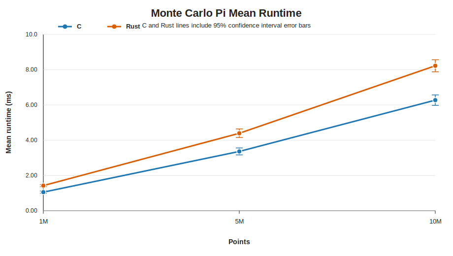
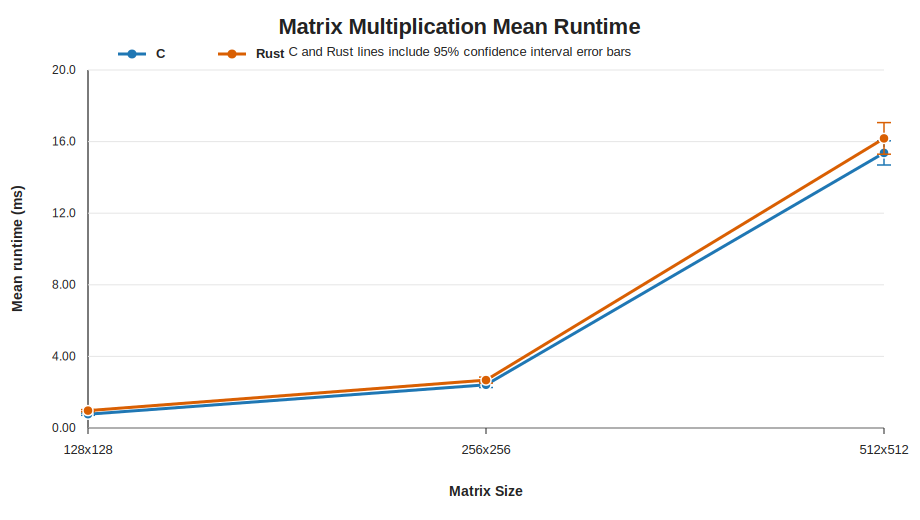
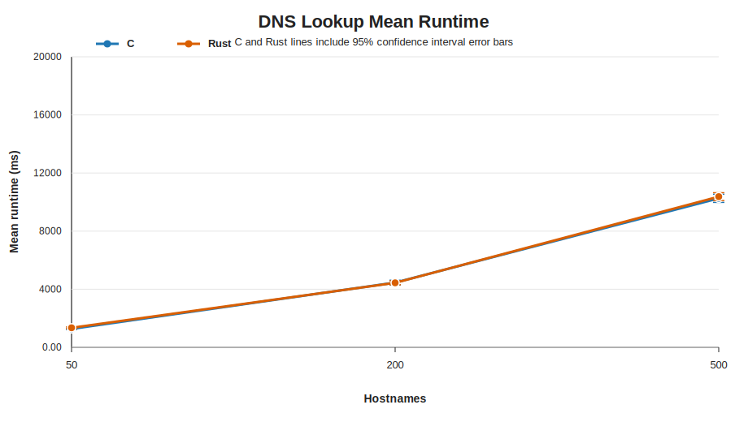

---
tags:
  - csci440
  - operating-systems
  - threads
  - benchmark
cssclasses:
  - osfinal-paper
last_updated: 2026-05-12
source: results/benchmark_summary.csv
---

# CSCI440 Final Project: C vs Rust Thread Performance

## Approved Question

The question I chose for this project is: **How does the performance of threads in C compare to Rust?**

To answer this, I compared C programs using POSIX pthreads against Rust programs using `std::thread`. I used the same number of worker threads in both languages and measured runtime across three different threaded workloads:

- **Monte Carlo pi estimation:** each thread generates random points and counts how many fall inside a unit circle.
- **Matrix multiplication:** each thread computes a range of rows in a square matrix multiplication.
- **DNS hostname resolution:** each thread resolves part of a hostname list using the operating system resolver.

I used three workload sizes for each algorithm so that the experiment measured more than one input size. Monte Carlo used 1 million, 5 million, and 10 million points. Matrix multiplication used 128x128, 256x256, and 512x512 matrices. DNS lookup used 50, 200, and 500 hostnames.

The DNS input files were expanded after feedback from my professor. The simple submission files are `data/dns/names_50.txt`, `data/dns/names_200.txt`, and `data/dns/names_500.txt`. The actual benchmark uses static per-trial and per-language hostname files under `data/dns/trials/`, so C and Rust do not reuse the same DNS names and later trials do not repeat earlier trial hostnames. The names use unique `nip.io` wildcard DNS hostnames so they resolve consistently while still avoiding repeated fully qualified domain names.

## Experimental Setup

The experiment was run on my Windows machine using Ubuntu under WSL2. The Linux environment was used because the C implementation depends on POSIX APIs such as pthreads and `clock_gettime`.

| Component | Configuration |
| --- | --- |
| CPU | 11th Gen Intel Core i5-11400F at 2.60 GHz |
| CPU layout | 6 physical cores, 12 logical CPUs |
| Memory available to WSL | 7.7 GiB |
| Operating system | Ubuntu 24.04.1 LTS under WSL2 |
| Kernel | `6.6.114.1-microsoft-standard-WSL2` |
| C compiler | GCC 13.3.0 |
| Rust compiler | rustc 1.94.0 |
| Cargo | cargo 1.94.0 |
| Thread count | 12 worker threads |
| Trials per case | 50 |

Several artifacts could affect the runtime measurements. WSL2 adds virtualization overhead because the Linux programs are running through a virtualized environment on Windows. Background Windows processes can interrupt the CPU while tests are running. CPU frequency scaling may change results because the processor can boost or throttle depending on temperature and load. DNS lookup is especially noisy because it depends on DNS cache state, resolver latency, and network behavior outside the benchmark code. Matrix multiplication can also be affected by CPU cache behavior because small matrices fit more easily in cache than larger matrices.

To reduce noise, I ran all tests on the same machine, used the same WSL2 environment, used the same thread count for both languages, used the same workload sizes, and ran each case 50 times. For DNS, I also used unique per-trial hostname files to reduce the chance that a later measurement was only timing a cached lookup from an earlier run.

## Testing Procedure

The project contains separate C and Rust implementations for each workload. The C programs are compiled with `gcc` using optimization level `-O2`, warnings enabled, and pthread support. The Rust programs are compiled with `cargo build --release`.

The DNS input files are static files included with the project. The benchmark runner validates those DNS input files, builds the programs, runs each benchmark repeatedly, and stores raw timing data in `results/benchmark_raw.csv`. The result analyzer summarizes the raw data into `results/benchmark_summary.csv`. The graph script creates SVG line charts in `results/graphs/`.

The timing methods were:

- C: `clock_gettime(CLOCK_MONOTONIC)`
- Rust: `std::time::Instant`

I used this command sequence:

```bash
cd /home/sabana/code/OSFINAL
THREADS=12 TRIALS=50 DNS_SIZES=50,200,500 python3 scripts/run_benchmarks.py
python3 scripts/analyze_results.py results/benchmark_raw.csv results/benchmark_summary.csv
python3 scripts/make_graphs.py results/benchmark_summary.csv results/graphs
```

For each language/workload/input-size case, I ran 50 trials. There were 3 algorithms, 3 workload sizes per algorithm, 2 languages, and 50 trials per case, for a total of 900 timed program runs.

For confidence intervals, I used a 95% confidence value with z-score **1.96**. The margin of error was calculated from the 95% confidence interval half-width divided by the mean runtime.

## Test Results

Lower runtime is better in all tables and graphs.

The strongest result was from Monte Carlo pi estimation. C was faster than Rust at all three input sizes, and the 95% confidence intervals did not overlap. Matrix multiplication was closer: C was clearly faster for the smallest matrix size, but the larger matrix sizes had overlapping confidence intervals. DNS lookup was the noisiest workload because DNS performance depends on the operating system resolver, cache behavior, and network conditions.

### Runtime Graphs

The graphs below are Python-generated SVG line charts. Each line shows mean runtime, and each point includes a 95% confidence interval error bar.

#### Monte Carlo Pi



#### Matrix Multiplication



#### DNS Lookup



<div class="page-break"></div>

### Results Table

| Algorithm | Workload | C mean ms +/- 95% CI | Rust mean ms +/- 95% CI | Lower mean | Speedup | CI reading |
| --- | --- | --- | --- | --- | --- | --- |
| Monte Carlo Pi | 1M | 1.052 +/- 0.062 | 1.426 +/- 0.059 | C | 1.36x | C likely faster |
| Monte Carlo Pi | 5M | 3.364 +/- 0.197 | 4.395 +/- 0.243 | C | 1.31x | C likely faster |
| Monte Carlo Pi | 10M | 6.273 +/- 0.295 | 8.223 +/- 0.342 | C | 1.31x | C likely faster |
| Matrix Multiplication | 128x128 | 0.773 +/- 0.062 | 0.969 +/- 0.061 | C | 1.25x | C likely faster |
| Matrix Multiplication | 256x256 | 2.412 +/- 0.148 | 2.675 +/- 0.169 | C | 1.11x | Overlapping 95% CIs |
| Matrix Multiplication | 512x512 | 15.370 +/- 0.674 | 16.179 +/- 0.883 | C | 1.05x | Overlapping 95% CIs |
| DNS Lookup | 50 | 1270.833 +/- 49.872 | 1347.065 +/- 53.507 | C | 1.06x | Overlapping 95% CIs |
| DNS Lookup | 200 | 4457.635 +/- 161.928 | 4441.433 +/- 131.713 | Rust | 1.00x | Overlapping 95% CIs |
| DNS Lookup | 500 | 10257.878 +/- 278.299 | 10371.991 +/- 267.931 | C | 1.01x | Overlapping 95% CIs |

### Accuracy And Margin Of Error

The assignment recommends aiming for a margin of error around 5-10%. The current 50-trial results are within that target for every case. DNS still has larger absolute timing swings than the CPU-bound workloads, but its relative margin of error stayed below 4% in this run because the mean DNS runtimes are much larger.

| Algorithm | Language | Workload | Runs | Stdev ms | Margin Error |
| --- | --- | --- | --- | --- | --- |
| Monte Carlo Pi | C | 1M | 50 | 0.222 | 5.85% |
| Monte Carlo Pi | Rust | 1M | 50 | 0.213 | 4.13% |
| Monte Carlo Pi | C | 5M | 50 | 0.710 | 5.85% |
| Monte Carlo Pi | Rust | 5M | 50 | 0.878 | 5.54% |
| Monte Carlo Pi | C | 10M | 50 | 1.065 | 4.71% |
| Monte Carlo Pi | Rust | 10M | 50 | 1.234 | 4.16% |
| Matrix Multiplication | C | 128x128 | 50 | 0.224 | 8.02% |
| Matrix Multiplication | Rust | 128x128 | 50 | 0.220 | 6.29% |
| Matrix Multiplication | C | 256x256 | 50 | 0.535 | 6.15% |
| Matrix Multiplication | Rust | 256x256 | 50 | 0.609 | 6.31% |
| Matrix Multiplication | C | 512x512 | 50 | 2.432 | 4.39% |
| Matrix Multiplication | Rust | 512x512 | 50 | 3.187 | 5.46% |
| DNS Lookup | C | 50 | 50 | 179.921 | 3.92% |
| DNS Lookup | Rust | 50 | 50 | 193.038 | 3.97% |
| DNS Lookup | C | 200 | 50 | 584.187 | 3.63% |
| DNS Lookup | Rust | 200 | 50 | 475.179 | 2.97% |
| DNS Lookup | C | 500 | 50 | 1004.016 | 2.71% |
| DNS Lookup | Rust | 500 | 50 | 966.612 | 2.58% |

## Conclusion / Answer To The Question

Based on these results, the performance comparison depends on the workload.

For Monte Carlo pi estimation, C pthreads were clearly faster than Rust threads. C was about 1.31x to 1.36x faster across the three input sizes, and the confidence intervals did not overlap. This is the strongest evidence in the experiment because the workload is CPU-bound and relatively controlled.

For matrix multiplication, C had the lower mean runtime at all three matrix sizes. The 128x128 case was clearly faster for C, but the 256x256 and 512x512 confidence intervals overlapped, so I would not claim a statistically meaningful difference for those larger cases. This suggests that memory access patterns, cache behavior, and compiler optimization may matter more than the thread API itself for this workload.

For DNS lookup, the lower mean changed depending on input size: C was lower for 50 and 500 hostnames, while Rust was slightly lower for 200 hostnames. However, all DNS comparisons had overlapping confidence intervals. Because DNS depends on resolver cache state, network latency, and OS behavior, I interpret the DNS result as inconclusive rather than a clear win for either language.

Overall, C was faster for the Monte Carlo workload and the smallest matrix multiplication workload. C and Rust were mostly comparable for the larger matrix sizes and DNS lookup. My answer is that C pthreads can be faster for simple CPU-bound threaded work, but the difference is not universal. For workloads where memory behavior or OS services dominate, the workload itself can matter more than the language thread API.

## Learning Outcome

This project taught me that benchmarking threaded programs is more complicated than just timing one run. I had to think about workload choice, input size, repeated trials, and sources of noise. The Monte Carlo results were straightforward because the workload was mostly CPU-bound, but DNS lookup showed how external OS and network behavior can make results much harder to interpret.

I also learned that statistical analysis matters. A lower mean runtime by itself is not always enough to make a strong claim. For example, some matrix multiplication and DNS comparisons had lower means for one language, but the confidence intervals overlapped, so I should interpret those results carefully. Running 50 trials helped make the CPU-bound results more reliable and made the DNS noise visible.

Finally, I learned more about the tradeoff between C and Rust. C pthreads can be very fast, but Rust provides safer abstractions while still using native operating system threads. The project helped me see that performance differences depend heavily on the workload, compiler optimization, memory access patterns, and operating system behavior.

## Code Submission

The code for this project is included in the `OSFINAL` folder.

- C source code: `c/src/`
- C build file: `c/Makefile`
- Rust source code: `rust/src/bin/`
- Rust project files: `rust/Cargo.toml` and `rust/Cargo.lock`
- Benchmark scripts: `scripts/run_benchmarks.py`, `scripts/analyze_results.py`, and `scripts/make_graphs.py`
- DNS input data: `data/dns/`
- Raw and summarized results: `results/benchmark_raw.csv` and `results/benchmark_summary.csv`
- Generated graphs: `results/graphs/`

Compiled binaries and build directories do not need to be submitted because they can be regenerated with the included source code and build scripts.

## References

- CSU Chico CSCI440 final project prompt, provided in the course repository README.
- Previous local DNS assignment used as reference for DNS lookup concepts and input format: `../CSCI440-DNS-Name-Resolution-Engine-IPC`.
- POSIX pthread documentation: `man pthread_create`, `man pthread_join`, and `man pthreads`.
- POSIX monotonic clock documentation: `man clock_gettime`.
- POSIX DNS resolver documentation: `man getaddrinfo`.
- `nip.io` wildcard DNS service: <https://nip.io/>
- Rust standard library documentation for `std::thread`: <https://doc.rust-lang.org/std/thread/>
- Rust standard library documentation for `std::time::Instant`: <https://doc.rust-lang.org/std/time/struct.Instant.html>
- Rust standard library documentation for `std::net::ToSocketAddrs`: <https://doc.rust-lang.org/std/net/trait.ToSocketAddrs.html>

## AI Assistance Citation

I used OpenAI ChatGPT/Codex as an AI assistant while planning and drafting this project. The assistant helped create the project scaffold, starter benchmark implementations, result analysis scripts, static DNS input files, Obsidian Markdown formatting, graph scripts, and draft explanation text. I reviewed and edited the generated material before submission.

OpenAI. (2026, May 12). *ChatGPT/Codex assistance with CSCI440 final project planning, benchmark code, data analysis, graph generation, and report drafting* [Large language model]. Prompt summary: Help plan and write a CSCI440 final project comparing C pthread performance with Rust thread performance using Monte Carlo pi estimation, matrix multiplication, and DNS lookup workloads. Create larger unique static DNS input files, rerun benchmark trials, create Python-generated graphs, and update the Obsidian Markdown report.
