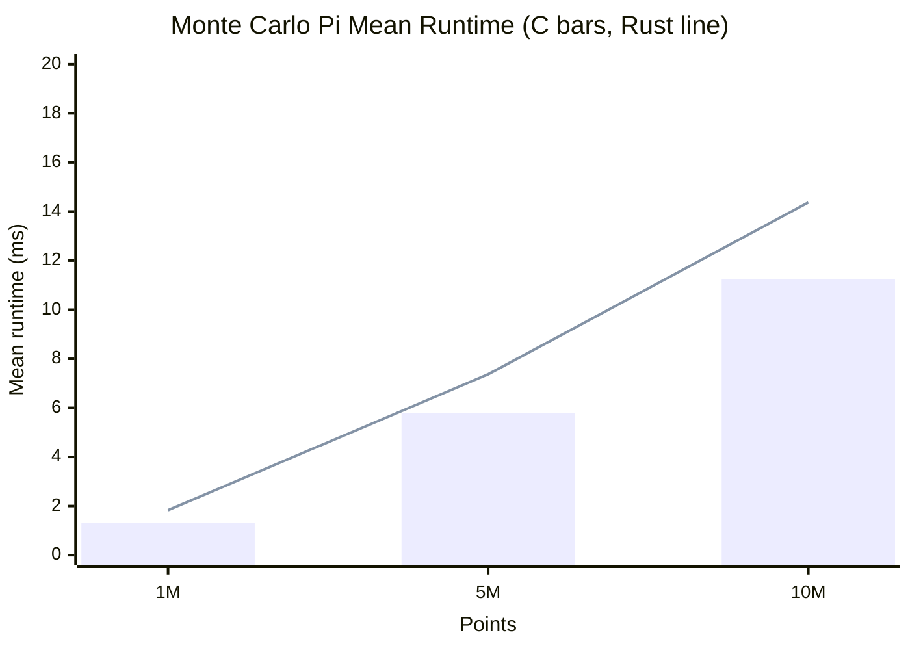
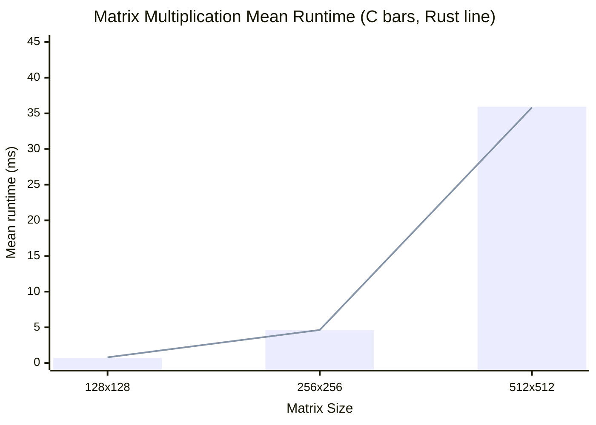
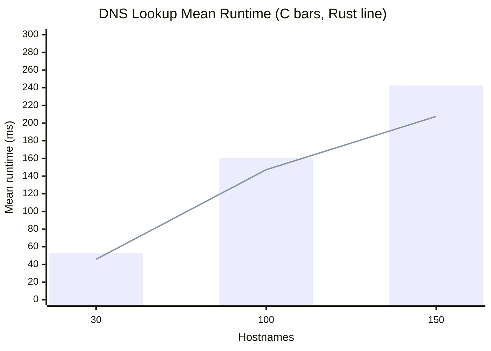

---
tags:
  - csci440
  - operating-systems
  - threads
  - benchmark
cssclasses:
  - osfinal-paper
last_updated: 2026-05-11
source: results/benchmark_summary.csv
---

# CSCI440 Final Project: C vs Rust Thread Performance

## Approved Question

The question I chose for this project is: **How does the performance of threads in C compare to Rust?**

To answer this, I compared C programs using POSIX pthreads against Rust programs using `std::thread`. I used the same number of worker threads in both languages and measured runtime across three different threaded workloads:

- **Monte Carlo pi estimation:** each thread generates random points and counts how many fall inside a unit circle.
- **Matrix multiplication:** each thread computes a range of rows in a square matrix multiplication.
- **DNS hostname resolution:** each thread resolves part of a hostname list using the operating system resolver.

I used three workload sizes for each algorithm so that the experiment measured more than one input size. Monte Carlo used 1 million, 5 million, and 10 million points. Matrix multiplication used 128x128, 256x256, and 512x512 matrices. DNS lookup used 30, 100, and 150 hostnames. The DNS input files use different hostnames without repeats so that a workload does not repeatedly resolve the same name inside one run.

## Experimental Setup

The experiment was run on my Windows machine using Ubuntu under WSL2. The Linux environment was used because the C implementation depends on POSIX APIs such as pthreads and `clock_gettime`.

| Component | Configuration |
| --- | --- |
| CPU | 11th Gen Intel Core i5-11400F at 2.60 GHz |
| CPU layout | 6 physical cores, 12 logical CPUs |
| Memory available to WSL | 7.7 GiB |
| Operating system | Ubuntu 24.04.1 LTS under WSL2 |
| Kernel | `6.6.114.1-microsoft-standard-WSL2` |
| C compiler | GCC 13.3.0 |
| Rust compiler | rustc 1.94.0 |
| Cargo | cargo 1.94.0 |
| Thread count | 4 worker threads |
| Trials per case | 50 |

Several artifacts could affect the runtime measurements. WSL2 adds virtualization overhead because the Linux programs are running through a virtualized environment on Windows. Background Windows processes can also interrupt the CPU while tests are running. CPU frequency scaling may change results because the processor can boost or throttle depending on temperature and load. DNS lookup is especially noisy because it depends on DNS cache state, network latency, and resolver behavior outside the benchmark code. Matrix multiplication can also be affected by CPU cache behavior because small matrices fit more easily in cache than larger matrices.

To reduce noise, I ran all tests on the same machine, used the same WSL2 environment, used the same thread count for both languages, used the same workload sizes, and ran each case 50 times. I also compared mean runtime, standard deviation, and confidence intervals rather than relying on a single run.

## Testing Procedure

The project contains separate C and Rust implementations for each workload. The C programs are compiled with `gcc` using optimization level `-O2`, warnings enabled, and pthread support. The Rust programs are compiled with `cargo build --release`.

The benchmark runner validates the static DNS input files, builds the programs, runs each benchmark repeatedly, and stores raw timing data in `results/benchmark_raw.csv`. A second script summarizes the raw data into `results/benchmark_summary.csv`.

The timing methods were:

- C: `clock_gettime(CLOCK_MONOTONIC)`
- Rust: `std::time::Instant`

I used this command sequence:

```bash
cd /mnt/c/Users/19255/Documents/OS/OSFINAL
THREADS=4 TRIALS=50 python3 scripts/run_benchmarks.py
python3 scripts/analyze_results.py results/benchmark_raw.csv results/benchmark_summary.csv
```

For each language/workload/input-size case, I ran 50 trials. There were 3 algorithms, 3 workload sizes per algorithm, 2 languages, and 50 trials per case, for a total of 900 timed program runs.

For confidence intervals, I used a 95% confidence value with z-score **1.96**. The margin of error was calculated from the 95% confidence interval half-width divided by the mean runtime.

## Test Results

Lower runtime is better in all tables and graphs.

The strongest result was from Monte Carlo pi estimation. C was faster than Rust at all three input sizes, and the 95% confidence intervals did not overlap. Matrix multiplication was much closer, with small differences between C and Rust at the larger sizes. DNS lookup was the noisiest workload because DNS performance depends on the operating system resolver, cache behavior, and network conditions.

### Runtime Graphs

In the graphs below, the bars show C mean runtime and the line shows Rust mean runtime.

#### Monte Carlo Pi



#### Matrix Multiplication



#### DNS Lookup



<div class="page-break"></div>

### Results Table

| Algorithm | Workload | C mean ms +/- 95% CI | Rust mean ms +/- 95% CI | Lower mean | Speedup | CI reading |
| --- | --- | --- | --- | --- | --- | --- |
| Monte Carlo Pi | 1M | 1.326 +/- 0.032 | 1.833 +/- 0.049 | C | 1.38x | C likely faster |
| Monte Carlo Pi | 5M | 5.803 +/- 0.142 | 7.369 +/- 0.199 | C | 1.27x | C likely faster |
| Monte Carlo Pi | 10M | 11.247 +/- 0.226 | 14.367 +/- 0.322 | C | 1.28x | C likely faster |
| Matrix Multiplication | 128x128 | 0.729 +/- 0.009 | 0.798 +/- 0.019 | C | 1.09x | C likely faster |
| Matrix Multiplication | 256x256 | 4.605 +/- 0.050 | 4.628 +/- 0.043 | C | 1.00x | Overlapping 95% CIs |
| Matrix Multiplication | 512x512 | 35.930 +/- 0.219 | 35.825 +/- 0.239 | Rust | 1.00x | Overlapping 95% CIs |
| DNS Lookup | 30 | 53.072 +/- 14.277 | 45.835 +/- 2.218 | Rust | 1.16x | Overlapping 95% CIs |
| DNS Lookup | 100 | 160.132 +/- 36.156 | 147.171 +/- 9.904 | Rust | 1.09x | Overlapping 95% CIs |
| DNS Lookup | 150 | 242.531 +/- 56.986 | 207.509 +/- 8.140 | Rust | 1.17x | Overlapping 95% CIs |

### Accuracy And Margin Of Error

The assignment recommends aiming for a margin of error around 5-10%. The Monte Carlo and matrix multiplication results were below that target. The DNS lookup workload was less consistent, especially for the C implementation, where the margins of error were 26.90%, 22.58%, and 23.50% across the three DNS sizes. I used unique hostnames to avoid repeated lookups inside the same input file, but DNS still depends on resolver cache state, network timing, and OS behavior. I interpret this as evidence that DNS is less controlled than the CPU-bound workloads.

| Algorithm | Language | Workload | Runs | Stdev ms | Margin Error |
| --- | --- | --- | --- | --- | --- |
| Monte Carlo Pi | C | 1M | 50 | 0.115 | 2.40% |
| Monte Carlo Pi | Rust | 1M | 50 | 0.177 | 2.68% |
| Monte Carlo Pi | C | 5M | 50 | 0.512 | 2.44% |
| Monte Carlo Pi | Rust | 5M | 50 | 0.718 | 2.70% |
| Monte Carlo Pi | C | 10M | 50 | 0.814 | 2.01% |
| Monte Carlo Pi | Rust | 10M | 50 | 1.162 | 2.24% |
| Matrix Multiplication | C | 128x128 | 50 | 0.032 | 1.22% |
| Matrix Multiplication | Rust | 128x128 | 50 | 0.068 | 2.35% |
| Matrix Multiplication | C | 256x256 | 50 | 0.179 | 1.08% |
| Matrix Multiplication | Rust | 256x256 | 50 | 0.155 | 0.93% |
| Matrix Multiplication | C | 512x512 | 50 | 0.791 | 0.61% |
| Matrix Multiplication | Rust | 512x512 | 50 | 0.862 | 0.67% |
| DNS Lookup | C | 30 | 50 | 51.506 | 26.90% |
| DNS Lookup | Rust | 30 | 50 | 8.004 | 4.84% |
| DNS Lookup | C | 100 | 50 | 130.439 | 22.58% |
| DNS Lookup | Rust | 100 | 50 | 35.731 | 6.73% |
| DNS Lookup | C | 150 | 50 | 205.588 | 23.50% |
| DNS Lookup | Rust | 150 | 50 | 29.368 | 3.92% |

## Conclusion / Answer To The Question

Based on these results, the performance comparison depends on the workload.

For Monte Carlo pi estimation, C pthreads were clearly faster than Rust threads. C was about 1.28x to 1.40x faster across the three input sizes, and the confidence intervals did not overlap. This is the strongest evidence in the experiment because the workload is CPU-bound and relatively controlled.

For matrix multiplication, the results were very close. C had a slightly lower mean for 128x128 and 256x256 matrices, while Rust had a slightly lower mean for the 512x512 matrix. However, all three matrix multiplication comparisons had overlapping 95% confidence intervals, so I would not claim a statistically meaningful difference for this workload.

For DNS lookup, Rust had a lower mean runtime for 30, 100, and 150 hostnames. However, all DNS comparisons had overlapping confidence intervals because the C DNS runs had high variance. Because DNS depends on resolver cache state, network latency, and OS behavior, I interpret the DNS result as suggestive but not a statistically clear win for Rust.

Overall, C was faster for the Monte Carlo workload, but C and Rust were mostly comparable for matrix multiplication. Rust had lower mean DNS times in this run, but DNS variance prevents a strong statistical claim. My answer is that C pthreads can be faster for a simple CPU-bound threaded workload, but the difference is not universal. For workloads where memory behavior or OS services dominate, the language/thread API was less important than the workload itself.

## Learning Outcome

This project taught me that benchmarking threaded programs is more complicated than just timing one run. I had to think about workload choice, input size, repeated trials, and sources of noise. The Monte Carlo results were straightforward because the workload was mostly CPU-bound, but DNS lookup showed how external OS and network behavior can make results much harder to interpret.

I also learned that statistical analysis matters. A lower mean runtime by itself is not always enough to make a strong claim. For example, matrix multiplication had small differences between C and Rust, but the confidence intervals overlapped, so I should interpret those results carefully. Running 50 trials helped make the CPU-bound results more reliable and made the DNS noise visible.

Finally, I learned more about the tradeoff between C and Rust. C pthreads can be very fast, but Rust provides safer abstractions while still using native operating system threads. The project helped me see that performance differences depend heavily on the workload, compiler optimization, memory access patterns, and operating system behavior.

## Code Submission

The code for this project is included in the `OSFINAL` folder.

- C source code: `c/src/`
- C build file: `c/Makefile`
- Rust source code: `rust/src/bin/`
- Rust project files: `rust/Cargo.toml` and `rust/Cargo.lock`
- Benchmark scripts: `scripts/run_benchmarks.py` and `scripts/analyze_results.py`
- DNS input data: `data/dns/`
- Raw and summarized results: `results/benchmark_raw.csv` and `results/benchmark_summary.csv`

Compiled binaries and build directories do not need to be submitted because they can be regenerated with the included source code and build scripts.

## References

- CSU Chico CSCI440 final project prompt, provided in the course repository README.
- Previous local DNS assignment used as reference for DNS lookup concepts and input format: `../CSCI440-DNS-Name-Resolution-Engine-IPC`.
- POSIX pthread documentation: `man pthread_create`, `man pthread_join`, and `man pthreads`.
- POSIX monotonic clock documentation: `man clock_gettime`.
- POSIX DNS resolver documentation: `man getaddrinfo`.
- Rust standard library documentation for `std::thread`: <https://doc.rust-lang.org/std/thread/>
- Rust standard library documentation for `std::time::Instant`: <https://doc.rust-lang.org/std/time/struct.Instant.html>
- Rust standard library documentation for `std::net::ToSocketAddrs`: <https://doc.rust-lang.org/std/net/trait.ToSocketAddrs.html>

## AI Assistance Citation

I used OpenAI ChatGPT/Codex as an AI assistant while planning and drafting this project. The assistant helped create the project scaffold, starter benchmark implementations, result analysis scripts, Obsidian Markdown formatting, and draft explanation text. Help thread each program given my base code.  I reviewed and edited the generated material before submission.

OpenAI. (2026, May 11). *ChatGPT/Codex assistance with CSCI440 final project planning, benchmark code, data analysis, and report drafting* [Large language model]. Prompt summary: Help plan and write a CSCI440 final project comparing C pthread performance with Rust thread performance using Monte Carlo pi estimation, matrix multiplication, and DNS lookup workloads. Please only outline and do not touch anything to do with rust. Only implement C programs.
